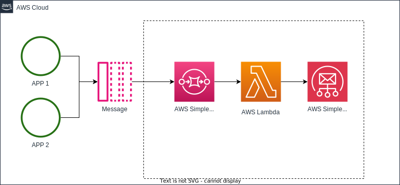

# Lambda SES-SQS-Processor

## Descrição

Esta função Lambda AWS foi projetada para processar mensagens da fila SQS (Simple Queue Service) e enviar e-mails usando o serviço SES (Simple Email Service).



## Funcionalidades Principais

- **Receber Mensagens SQS**: A função é acionada automaticamente quando novas mensagens são enviadas para a fila SQS associada.
  
- **Enviar E-mails usando SES**: Cada mensagem recebida é processada para extrair informações como assunto, corpo e endereços de e-mail, e então um e-mail é enviado usando o SES.

- **Excluir Mensagens após Processamento**: Após o envio bem-sucedido do e-mail, a mensagem correspondente é excluída automaticamente da fila SQS.

## Configuração

Antes de usar esta função Lambda, certifique-se de configurar corretamente:

- **Permissões IAM**: Garanta que a função Lambda tenha permissões adequadas para acessar SQS e SES. Exemplos de políticas podem ser encontrados no AWS IAM.

- **Configuração da Fila SQS**: A URL da fila SQS e suas configurações devem ser especificadas na função Lambda.

## Evento de Gatilho

Esta função Lambda é configurada para ser acionada por eventos de novas mensagens na fila SQS associada. Certifique-se de configurar a fila SQS para enviar eventos para a função Lambda.

## Como Usar

1. **Deploy da Função Lambda**: Faça o deploy desta função Lambda usando o AWS CLI ou a Console da AWS.

2. **Configuração da Fila SQS**: Certifique-se de configurar a fila SQS para enviar eventos para esta função Lambda.

3. **Permissões IAM**: Verifique e configure as permissões IAM necessárias para a função Lambda acessar SQS e SES.

4. **Teste da Função**: Envie mensagens para a fila SQS e verifique os logs da função Lambda para garantir que as mensagens são processadas corretamente.

## Exemplo de Uso

```go
// Exemplo de envio de mensagem SQS
// ...

// Mensagem SQS enviada:
// {
//   "Subject": "Assunto do Email",
//   "Body": "Corpo do Email",
//   "ToAddresses": ["destinatario@example.com"],
//   "FromEmailAddress": "remetente@example.com"
// }
